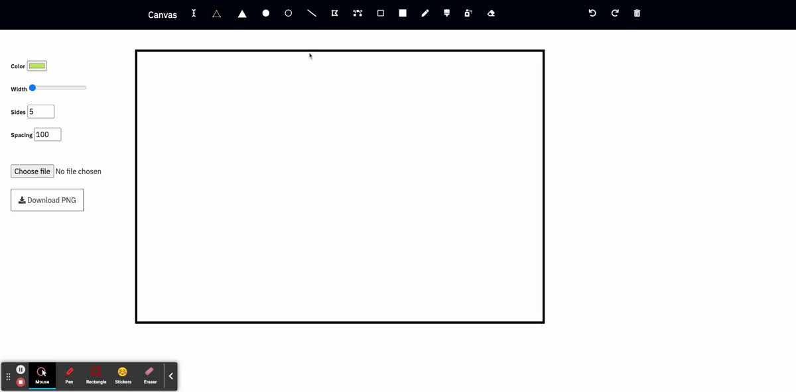

# Canvas

### About Project

This project allows you to create artwork on the browser, by utilising Canvas from HTML and Javascript.

(link to project http://unable-business.surge.sh/)

### How to run this package

- Clone the project & open index.html

#### Features

| Pen         | Additional settings |
| ----------- | ------------------- |
| Pen         | (colour)            |
| Brush       | (colour, width)     |
| Pen         | (colour)            |
| Spray-paint | (colour)            |
| Eraser      | N/A                 |

##### Shapes

| Shapes           | Additional settings      |
| ---------------- | ------------------------ |
| rectangle        | (colour)                 |
| rectangle stroke | (colour, width)          |
| circle           | (colour)                 |
| circle stroke    | (colour, width)          |
| Triangle         | (colour)                 |
| Triangle stroke  | (colour, width)          |
| Line             | (colour, width)          |
| Beizer curve     | (Spacing, width, colour) |
| Polygon          | (colour, sides)          |

##### Other

| Other      | Additional settings |
| ---------- | ------------------- |
| Undo       | N/A                 |
| Redo       | N/A                 |
| Bin        | N/A                 |
| Upload     | N/A                 |
| Save Image | (save image as PNG) |
